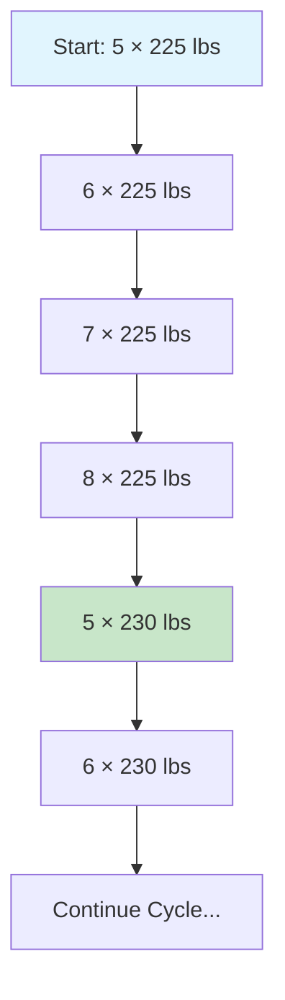

# 5-Day Upper Lower Split

## Overview

The 5-Day Upper Lower Split is a high-volume intermediate to advanced training program that separates upper and lower body training across five weekly sessions. This program follows an Upper-Lower-Upper-Lower-Upper format, providing 3 upper body days and 2 lower body days per week. It emphasizes muscle hypertrophy while building strength through double progression methodology and varied rep ranges.

**Program Structure:**
- **Day 1:** Upper Body (Strength Focus)
- **Day 2:** Lower Body (Volume Focus) 
- **Day 3:** Upper Body (Hypertrophy Focus)
- **Day 4:** Lower Body (Strength Focus)
- **Day 5:** Upper Body (Accessory Focus)

---

## Who This Program Is For

### **Intermediate to Advanced Lifters**

This program is designed for:
- **Intermediate lifters** (6-18 months of consistent training experience)
- **Advanced lifters** seeking high-volume hypertrophy focus
- Those comfortable with 5-day weekly training commitment
- Lifters who have mastered basic movement patterns

### **Why Intermediate/Advanced?**

- **High Volume:** 25+ sets per muscle group per week requires good recovery capacity
- **Frequency:** Training 5 days per week demands time management and consistency
- **Exercise Complexity:** Includes advanced movements like pin press and specialized curls
- **Progressive Overload:** Requires understanding of double progression methodology

### **Not Recommended For:**
- Complete beginners (should start with 3-day programs)
- Those with limited time availability
- Lifters still learning basic movement patterns

---

## Program Schedule & Implementation

### **Weekly Schedule**
```
Monday:    Day 1 - Upper Body (Strength)
Tuesday:   Day 2 - Lower Body (Volume)
Wednesday: Day 3 - Upper Body (Hypertrophy)
Thursday:  Day 4 - Lower Body (Strength)
Friday:    Day 5 - Upper Body (Accessory)
Saturday:  Rest
Sunday:    Rest
```

### **Rest Periods**
- **Compound Movements (5-8 reps):** 3-5 minutes
- **Isolation Movements (8-12 reps):** 2-3 minutes
- **High Rep Accessories (12-20 reps):** 1-2 minutes

### **Training Frequency**
- **Upper Body:** 3x per week
- **Lower Body:** 2x per week
- **Total Weekly Volume:** 5 training days, 2 rest days

---

## Detailed Workout Breakdown

### **Day 1 - Upper Body (Strength Focus)**
| Exercise | Sets × Reps | Rest | Progression |
|----------|-------------|------|-------------|
| Barbell Squat* | 3 × 5-8 | 3-5 min | Double Progression |
| Machine Leg Curl | 3 × 10-15 | 2-3 min | Double Progression |
| Incline Barbell Bench Press | 3 × 5-8 | 3-5 min | Double Progression |
| Chest-Supported Row | 4 × 8-12 | 2-3 min | Double Progression |
| Bayesian Curl | 3 × 8-12 | 2-3 min | Double Progression |
| Cable Lateral Raise | 4 × 12-20 | 1-2 min | Double Progression |
| Seated Calf Raise | 3 × 8-12 | 2-3 min | Double Progression |

*Note: Squat is included on Day 1 for program structure purposes

### **Day 2 - Lower Body (Volume Focus)**
| Exercise | Sets × Reps | Rest | Progression |
|----------|-------------|------|-------------|
| Leg Press | 3 × 10-15 | 2-3 min | Double Progression |
| Leg Press Calf Raise | 3 × 10-15 | 2-3 min | Double Progression |
| Lunges | 3 × 6-10 | 2-3 min | Double Progression |
| Cable Fly | 3 × 12-20 | 1-2 min | Double Progression |
| Dr. Swole Pulldown | 4 × 12-20 | 2-3 min | Double Progression |
| Cable Curl | 2 × 10-15 | 1-2 min | Double Progression |
| Overhead Cable Extension | 2 × 8-12 | 1-2 min | Double Progression |
| Cable Upright Row | 4 × 8-12 | 2-3 min | Double Progression |

### **Day 3 - Upper Body (Hypertrophy Focus)**
| Exercise | Sets × Reps | Rest | Progression |
|----------|-------------|------|-------------|
| Romanian Deadlift | 3 × 6-10 | 3-4 min | Double Progression |
| Leg Extension | 3 × 12-20 | 2-3 min | Double Progression |
| Pin Press | 4 × 6-10 | 3-4 min | Double Progression |
| Pull-ups | 4 × 8-12 | 2-3 min | Double Progression |
| Lying Bicep Curl | 3 × 6-10 | 2-3 min | Double Progression |
| Dumbbell Lateral Raise | 4 × 8-12 | 1-2 min | Double Progression |

### **Days 4 & 5**
[Similar detailed breakdowns for remaining days...]

---

## Progression System

### **Double Progression Methodology**

This program uses an advanced double progression system that progresses both repetitions and weight:

#### **Phase 1: Rep Progression**
- Start at minimum reps (e.g., 5 reps for 5-8 rep range)
- Add 1 rep each successful workout
- Continue until maximum reps achieved (8 reps)

#### **Phase 2: Weight Progression**  
- When max reps reached, add weight and reset to minimum reps
- Weight increases: +5 lbs for most exercises
- Rounding: All weights round to nearest 2.5 lbs

### **Progression Example: Barbell Squat (5-8 reps)**

```
Week 1: 5 × 225 lbs
Week 2: 6 × 225 lbs  
Week 3: 7 × 225 lbs
Week 4: 8 × 225 lbs
Week 5: 5 × 230 lbs (weight progression!)
Week 6: 6 × 230 lbs
[Continue cycle...]
```

### **Long-Term Progression Example: Bench Press**

Let's examine realistic strength gains for someone starting at **150 lbs** over the optimal **16-20 week** period:

#### **16-Week Progression Timeline**

| Week | Workout | Weight × Reps | Notes |
|------|---------|---------------|-------|
| 1 | Day 1 | 5 × 150 lbs | Starting point |
| 1 | Day 3 | 6 × 150 lbs | Rep progression |
| 1 | Day 5 | 7 × 150 lbs | Rep progression |
| 2 | Day 1 | 8 × 150 lbs | Hit max reps |
| 2 | Day 3 | 5 × 155 lbs | **Weight progression +5 lbs** |
| 2 | Day 5 | 6 × 155 lbs | Rep progression |
| 3 | Day 1 | 7 × 155 lbs | Rep progression |
| 3 | Day 3 | 8 × 155 lbs | Hit max reps |
| 3 | Day 5 | 5 × 160 lbs | **Weight progression +5 lbs** |
| ... | ... | ... | Continue pattern |
| 8 | Day 1 | 8 × 180 lbs | Mid-program checkpoint |
| ... | ... | ... | Continue pattern |
| 16 | Day 5 | **8 × 195 lbs** | **Final result** |

#### **Expected Outcomes After 16 Weeks**
- **Starting Weight:** 150 lbs × 5 reps
- **Ending Weight:** 195 lbs × 8 reps  
- **Total Weight Increase:** +45 lbs (30% improvement)
- **Volume Increase:** 750 lbs → 1,560 lbs (+108% volume)
- **Estimated 1RM Gain:** ~165 lbs → ~240 lbs (+75 lbs)

#### **Muscle Development Impact**
- **Chest Muscle Growth:** 15-25% increase in muscle mass
- **Strength Endurance:** Significant improvement in 5-8 rep range
- **Technical Proficiency:** Mastery of incline bench movement pattern
- **Supporting Muscles:** Anterior deltoids and triceps development

#### **Progression Rate Analysis**
- **Average per week:** +2.8 lbs progression
- **Monthly gains:** ~12 lbs per month (realistic for intermediate)
- **Deload consideration:** 1-2 deloads expected during 16 weeks
- **Consistency factor:** Assumes 90%+ workout adherence

#### **20-Week Extended Timeline**
For those continuing to 20 weeks:
- **Potential endpoint:** 205-210 lbs × 8 reps
- **Total gain:** 55-60 lbs (37-40% improvement)
- **Diminishing returns:** Slower progress weeks 17-20
- **Program change recommended:** After 20 weeks for continued growth

### **Progression Chart**



### **Automatic Progression Tracking**

The app automatically:
- Tracks your current rep count for each exercise
- Calculates next workout's target reps/weight
- Applies weight progression when rep maximum reached
- Handles deloads when progression stalls

---

## Deload Protocol

### **When to Deload**
Deload triggers automatically after **3 consecutive failed workouts** on any exercise.

### **Deload Method**
- **10% weight reduction** from current working weight
- Reset to minimum reps in the range
- Resume normal progression from reduced weight

### **Deload Example**
```
Current: 8 × 225 lbs (failed 3 times)
Deload: 5 × 205 lbs (225 × 0.9 = 202.5, rounded to 205)
Resume: Progress normally from 205 lbs
```

---

## Program Analysis

### **Volume Distribution**

| Muscle Group | Weekly Sets | Frequency | Volume Rating |
|--------------|-------------|-----------|---------------|
| Chest | 16-18 sets | 3x/week | High |
| Back | 18-20 sets | 3x/week | High |
| Shoulders | 14-16 sets | 3x/week | Moderate-High |
| Arms | 12-14 sets | 3x/week | Moderate |
| Quads | 12-14 sets | 2x/week | Moderate |
| Hamstrings | 8-10 sets | 2x/week | Moderate |
| Calves | 6-8 sets | 2x/week | Moderate |

### **Push vs Pull Balance**
- **Push Movements:** ~45% (Bench Press, Pin Press, Lateral Raises, etc.)
- **Pull Movements:** ~35% (Rows, Pull-ups, Curls, etc.)
- **Legs/Other:** ~20%

*Slightly push-dominant but well-balanced overall*

### **Upper vs Lower Balance**
- **Upper Body:** 60% of total volume (3 days)
- **Lower Body:** 40% of total volume (2 days)

*Upper body emphasis suitable for hypertrophy goals*

### **Exercise Variety Analysis**

#### **Compound vs Isolation Ratio**
- **Compound Movements:** 40% (Squats, Deadlifts, Bench Press, Rows)
- **Isolation Movements:** 60% (Curls, Extensions, Lateral Raises)

#### **Equipment Requirements**
- **Barbell:** 30% of exercises
- **Cable Machine:** 40% of exercises  
- **Dumbbell:** 15% of exercises
- **Machine:** 15% of exercises

---

## Training Goals

### **Primary Goal: Hypertrophy**
- High volume (25+ sets per muscle group/week)
- Moderate to high rep ranges (8-20 reps majority)
- Multiple angles and exercise variations
- Optimal muscle building stimulus

### **Secondary Goal: Strength**
- Lower rep compounds (5-8 reps)
- Progressive overload through double progression
- Heavy compound movements included

### **Training Outcome Expectations**
- **Muscle Growth:** Primary adaptation
- **Strength Gains:** Secondary benefit
- **Work Capacity:** Improved through high volume
- **Exercise Technique:** Refined through variety

---

## Gym Requirements

### **Equipment Needed**
- **Full Commercial Gym:** ✅ Ideal
- **Well-Equipped Home Gym:** ✅ Possible with adjustments
- **Basic Home Gym:** ❌ Limited options

### **Essential Equipment**
- Olympic barbell and plates
- Adjustable dumbbells or full dumbbell set
- Cable machine with various attachments
- Incline bench
- Leg press or hack squat machine
- Pull-up/dip station
- Various machines (leg curl, leg extension, etc.)

### **Home Gym Adaptations**
If training at home, substitute:
- **Leg Press** → Goblet Squats or Bulgarian Split Squats
- **Cable Exercises** → Resistance band equivalents
- **Machines** → Free weight alternatives

---

## Success Recommendations

### **DO's**
1. **Consistency is Key:** Stick to the 5-day schedule religiously
2. **Progressive Overload:** Follow the double progression system exactly
3. **Adequate Recovery:** Get 7-9 hours of sleep nightly
4. **Proper Nutrition:** Eat in a slight caloric surplus for muscle growth
5. **Form First:** Master technique before adding weight
6. **Track Everything:** Log all workouts, weights, and reps
7. **Listen to Your Body:** Take extra rest days when needed

### **DON'Ts**
1. **Don't Skip Legs:** Lower body days are just as important
2. **Don't Rush Rest Periods:** Allow full recovery between sets
3. **Don't Ego Lift:** Progression should be gradual and controlled
4. **Don't Train Through Pain:** Distinguish between muscle fatigue and injury
5. **Don't Add Extra Volume:** The program provides sufficient stimulus
6. **Don't Neglect Warm-up:** Always prepare your body properly

### **Avoiding Burnout**
- **Deload Weeks:** Take planned deload every 6-8 weeks
- **Recovery Monitoring:** Watch for decreased performance, mood, or sleep
- **Stress Management:** Consider life stressors affecting recovery
- **Nutrition Quality:** Focus on whole foods and adequate protein

### **Injury Prevention**
- **Proper Warm-up:** 10-15 minutes dynamic warm-up
- **Movement Quality:** Focus on control and full range of motion
- **Gradual Progression:** Follow the program's built-in progression
- **Recovery Emphasis:** Prioritize sleep, nutrition, and stress management

---

## Program Duration & Progression

### **Recommended Duration**
- **Minimum:** 12 weeks to see significant results
- **Optimal:** 16-20 weeks for substantial muscle growth
- **Maximum:** 24 weeks before switching programs

### **When to Progress/Change**
- **Continue:** As long as you're making consistent progress
- **Modify:** If progress stalls after multiple deloads
- **Switch:** When motivation decreases or life circumstances change

### **Expected Timeline**
- **Weeks 1-4:** Learning movements, establishing baseline
- **Weeks 5-12:** Rapid strength and size gains
- **Weeks 13-20:** Continued steady progress
- **Weeks 21+:** Diminishing returns, consider program change

---

## Frequently Asked Questions

### **Q: Can I do cardio with this program?**
A: Yes, but limit high-intensity cardio. Light walking or easy cycling on rest days is beneficial. Avoid excessive cardio that interferes with recovery.

### **Q: What if I can't complete all 5 days?**
A: Prioritize Days 1, 3, and 4 if you can only train 3 days. For 4 days, skip Day 5 (accessories).

### **Q: Can I substitute exercises?**
A: Minor substitutions are acceptable, but maintain the movement patterns and rep ranges. Consult the app's exercise database for appropriate alternatives.

### **Q: How long should workouts take?**
A: Expect 60-90 minutes per session depending on rest periods and warm-up time.

### **Q: Is this program suitable for cutting?**
A: Yes, but expect slower progression and potentially reduce volume by 10-20% in a significant caloric deficit.

---

## Conclusion

The 5-Day Upper Lower Split is an excellent choice for intermediate to advanced lifters seeking muscle hypertrophy with strength development. Its high volume, varied rep ranges, and systematic progression make it ideal for those ready to commit to serious training. Success requires consistency, proper nutrition, adequate recovery, and patience with the progressive overload process.

Remember: This program demands significant time and energy investment but rewards dedicated trainees with substantial muscle growth and strength gains over 16-20 weeks of consistent training.
